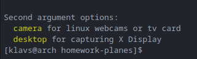

# Gst-Segment

## functionality
* Record 5 second video clips either from webcam or display

## CLI
Use either cargo run or the created binary in target/debug/gst-segment
* cargo run options - to display available launch options
* cargo run camera - to record your connected webcamera
* cargo run desktop - to record display

### Information
All recording are saved in the root folder under recordings/

